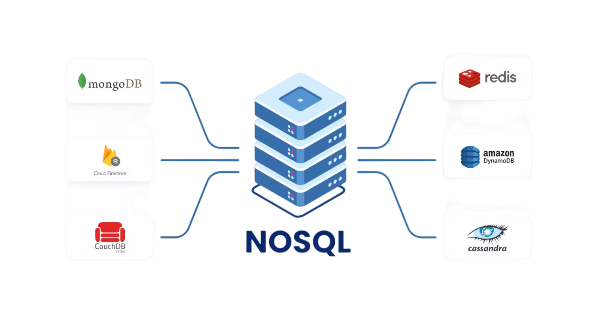

<!-- Here is the main logo and name of your project -->

<p align="center">
  <a href="resources/nosql.png">
    <picture>
      
    </picture>
    <h1 align="center">HandyDB</h1>
  </a>
</p>


<!-- Here are some cool labels for your project, delete those, that you don't need -->

<p align="center">
   <a aria-label="Translation to Russian" href="./README_RU.md">
      
   </a>
   <a aria-label="Repo size" href="https://github.com/worthant/labs-template-repository">
    
  </a>
  <a aria-label="Rust Version" href="https://www.rust-lang.org/">
    
  </a>
  <a aria-label="License" href="./LICENSE">
    
  </a>
</p>


<details open>
   <summary><b>Table of Contents</b></summary>

- [Demonstration](#demo)
- [Description](#descr)
- [Technical requirements](#requirements)
- [Topics for Lab Defense](#defense)
- [How to use my project](#user-manual)
- [Theoretical Materials](#theoretical-materials)

</details>

<a id="demo"></a>

## Demonstration 🎥

| embedded gif or mp4 |
|-------------------------------------------------------------------------------------------------------------------------------------------|

<a id="descr"></a>

## Description 📝

> 👋 **Welcome to the NoSQL Rust Database project!**
>
> 🛠 **What is it?**  
> The NoSQL Rust Database is a lightweight, high-performance NoSQL database written in Rust. It is designed for efficient data storage and retrieval.
>
> 🎯 **Purpose of the Database**  
> The purpose of this database is to provide a fast and reliable data storage solution for applications that require NoSQL capabilities. It is optimized for speed and scalability.
>
> ---
>
> 📌 **Key Features**
>
> - 🖥 Efficient data storage and retrieval.
> - 📊 NoSQL data model for flexible schema.
> - 🔒 High concurrency support.
>
> ---
>
> 🚀 **Dive in to explore** [how this works](#user-manual) 💻

<a id="requirements"></a>

## Technical Requirements

### Goal

    - Develop in-memory key-value store  
    - Use it as a nosql database if needed

#### 📋 Core Components

- [x] In-memory key-value store.
- [x] Shard Manager.
- [x] CLI.
- [x] Http server

#### 🎨 Design

1. [x] `DashMap` - **used as a core data structure in kv_store**

> It's a concurrent implementation of HashMap (manages concurrent access to data).

1. [ ] Transaction support
1. [x] `Tokio` - high **concurrent** **multithread** runtime enrivonment
1. [x] `Actix-web` - highly performant **http-server**, working in Tokio environment
1. [x] `KvPair model` - model for extending simple value functionality with some metadata
1. [x] `Shard model` - model of shard, representing **kv_stores** with **DashMap**

#### Sharding model

```r
+---------------------------------------------------+
| HandyDB Cluster                                   |
| +-----------+   +-----------+   +-----------+     |
| | Shard 1   |   | Shard 2   |   | Shard 3   |     |
| | Port 8081 |   | Port 8082 |   | Port 8083 |     |
| | Shard ID 1|   | Shard ID 2|   | Shard ID 3|     |
| +-----------+   +-----------+   +-----------+     |
|                                                   |
| +-------------------------------------------------+
| | Shard Manager (on each shard)                   |
| | - Knows other shards                            |
| | - Routes requests based on shard responsibility |
| +-------------------------------------------------+
```

<a id="user-manual"></a>

## How to Use My Project

Just download latest release and execute it

Usage for creating a shard:

```shell
./handy_db --port <port> --shard-id [Shard_ID]
```

Example:

```shell
./handy_db --port 32320 --shard-id shardA
```

<a id="theory"></a>

## Theoretical Materials

1. **Learn rust**: [Rust book](https://rust-book.cs.brown.edu/ch01-01-installation.html)
2. **Concurrency in Rust**: [Rust book chapter 16](https://rust-book.cs.brown.edu/ch16-00-concurrency.html)
3. **Cassandra nosql db**: [docs](https://cassandra.apache.org/_/cassandra-basics.html)
4. **What is nosql?**: [0](https://www.geeksforgeeks.org/types-of-nosql-databases/), [0.5](https://blazeclan.com/blog/dive-deep-types-nosql-databases/), [1](https://www.mongodb.com/nosql-explained), [2](https://javatechonline.com/types-of-nosql-databases-and-examples/#:~:text=Some%20examples%20of%20popular%20NoSQL,Riak%20are%20key%2Dvalue%20databases.), [3](https://www.spiceworks.com/tech/artificial-intelligence/articles/what-is-nosql/)
5. **Rust docs**: [docs](https://doc.rust-lang.org/std/index.html)
